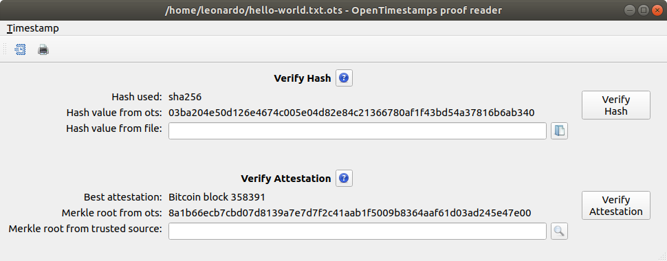

# OpenTimestamps proof reader

A standalone reader for OpenTimestamps (OTS) proofs. 
Use this to read or verify timestamps locally through a GUI.



## Getting started

Install the dependencies:
```
pip3 install opentimenstamps
pip3 install pyqt5
```

To run:
```
python3 ots-proof-reader.py
```

## Create a standalone executable

TODO

## License

See [LICENSE](LICENSE).

## Other licenses

Icons used in the applications are by [Yusuke Kamiyaman](http://p.yusukekamiyamane.com/) and by the 
[OpenTimestamp developers](https://github.com/opentimestamps/logo).
